# 🚀 SonicPrep AI: Real-Time Voice Interview Intelligence

<div align="center">


### **Elevating Engineering Interviews with Gemini-Powered Voice Intelligence**

[](https://nextjs.org/)
[](https://tailwindcss.com/)
[](https://firebase.google.com/)
[](https://ai.google.dev/)

---

[](https://vercel.com)
[](https://opensource.org/licenses/MIT)
[](http://makeapullrequest.com)
[](https://github.com/salonyranjan/sonic-prep)

</div>

---
## 📋 Table of Contents

* [✨ 1. Key Features](#1-key-features)
* [🎥 2. Live Demo](#2-live-demo)
    * [⚡ Zero-Latency Performance](#zero-latency-performance)
* [🏗️ 3. Architecture & Flows](#3-architecture--flows)
    * [📐 3.1 High-Level Architecture](#31-high-level-architecture)
    * [⚙️ 3.2 App Logic & State Flow](#32-app-logic--state-flow)
    * [🔄 3.3 Data Interaction Model](#33-data-interaction-model)
* [🛠️ 4. Tech Stack & Ecosystem](#4-tech-stack--ecosystem)
* [📊 5. Database & Schema](#5-database--schema)
    * [📋 5.1 Collections Schema](#51-collections-schema)
    * [💾 5.2 Document Blueprints](#52-document-blueprints)
    * [🔒 5.3 Security Rules](#53-security-rules)
* [📦 6. Installation & Setup](#6-installation--setup)
    * [⚙️ 6.1 Environment Config](#61-environment-config)
    * [🚀 6.2 Production Build](#62-production-build)
* [🤝 7. Contributing](#7-contributing)
    * [🗺️ 7.1 Future Roadmap](#71-future-roadmap)
* [👨‍💻 8. Developed By](#8-developed-by)
---

## 1.✨ Key Features

SonicPrep isn't just a mock interview tool; it's a **Real-Time Career Intelligence Agent** designed to simulate the high-pressure environment of top-tier technical interviews.

| 🎙️ Real-Time Voice AI | 🧠 Intelligent RAG | 📊 Behavioral Scoring |
| :--- | :--- | :--- |
| **Sub-500ms Latency**: Built on Vapi WebRTC for natural, human-like dialogue without the "AI pause." | **Domain-Specific**: Uses Pinecone to retrieve actual interview questions for your specific tech stack (MERN, Python, etc.). | **Post-Call Analytics**: Uses Gemini to analyze your tone, confidence, and technical accuracy. |

---

### 🚀 Advanced Functionalities

* **⚡ The "Sonic" Pipeline**: A custom-orchestrated audio path that handles STT (Speech-to-Text), LLM reasoning, and TTS (Text-to-Speech) simultaneously for zero-lag interactions.
* **🛠️ Tech-Stack Adaptation**: The AI dynamically adjusts its difficulty based on your selected stack—asking deep-dive questions on **Next.js Server Actions** or **NoSQL Schema Design**.
* **📂 Persistent Interview History**: Automatically saves your transcripts and scores to **Firebase**, allowing you to track your growth over time.
* **🌐 Community Exploration**: A public "Hall of Fame" where users can share their high-scoring interview sessions to help others learn.
* **🤖 Agentic Behavioral Feedback**: Beyond just text, the agent provides a "Communication Confidence" score based on your response pacing and vocabulary.

---

### 🎨 Cinematic User Experience
* **Glassmorphic UI**: A modern, high-contrast Dark Mode interface built with **Tailwind v4**.
* **Fluid Animations**: Interactive 3D elements and transitions powered by **GSAP** and **Framer Motion** for a "Cinematic" feel.
---
  

## 2.🎥 Live Demo

Experience **SonicPrep AI** in action. Our ultra-low latency voice pipeline allows for natural, fluid conversation without the typical AI "lag."

<div align="center">
  <a href="https://your-demo-link.vercel.app">
    
  </a>

  <br/>

  ### [🚀 Try the Live Demo Now](https://sonic-prep.vercel.app)
  
  *(Note: Requires Microphone Access and a stable internet connection for the best experience)*
</div>

---

### ⚡ Zero-Latency Performance
| Process | Status | Latency |
| :--- | :--- | :--- |
| **STT (Speech-to-Text)** | 🟢 Optimized | ~150ms |
| **LLM Reasoning (Gemini 2.5 Pro)** | 🟢 Real-time | ~350ms |
| **TTS (Text-to-Speech)** | 🟢 Fluid | ~100ms |
| **Total Round-Trip (Sonic Path)** | 🚀 **Elite** | **< 600ms** |

---

## 🏗️ 3. Architecture & Flows
SonicPrep AI is built on a **Decoupled 3-Tier Architecture**, separating the real-time voice stream from the persistent data and intelligence layers.
###  📐3.1 High-Level Project Architecture

```mermaid
graph TD
    %% Global Styling
    classDef clientNode fill:#111827,stroke:#22d3ee,stroke-width:2px,color:#fff;
    classDef edgeNode fill:#111827,stroke:#0ea5e9,stroke-width:2px,color:#fff;
    classDef brainNode fill:#111827,stroke:#A855F7,stroke-width:2px,color:#fff;

    %% Layer 1: Frontend (The Top Surface)
    subgraph Layer_1 [ ]
        direction LR
        U_CLIENT[💻 Dashboard UI]:::clientNode
        U_VOICE[🎤 Voice Widget]:::clientNode
    end
    
    %% Layer 2: Network (The Middle Bridge)
    subgraph Layer_2 [ ]
        direction LR
        E_ACTIONS[⚡ Server Actions]:::edgeNode
        E_VAPI[📶 Vapi Pipeline]:::edgeNode
    end

    %% Layer 3: Intelligence (The Foundation)
    subgraph Layer_3 [ ]
        direction LR
        C_GEMINI[🧠 Gemini Engine]:::brainNode
        C_PINE[🔍 Pinecone RAG]:::brainNode
        C_STORE[🗄️ Firestore]:::brainNode
    end

    %% Vertical Stack Connectivity (The 3D Depth)
    U_CLIENT --- E_ACTIONS
    U_VOICE --- E_VAPI
    E_ACTIONS --- C_STORE
    E_VAPI --- C_GEMINI
    C_GEMINI --- C_PINE

    %% Logical Flow (The Sonic Path)
    U_VOICE ==>|WebRTC Audio| E_VAPI
    E_VAPI ==>|Context| C_GEMINI
    C_GEMINI ==>|Behavioral Analysis| C_STORE
    C_GEMINI ==>|TTS Feedback| E_VAPI
    E_VAPI ==>|Response| U_VOICE

    %% Layer Styling to Create "Depth"
    style Layer_1 fill:#09090b,stroke:#22d3ee,stroke-width:4px
    style Layer_2 fill:#0c1a25,stroke:#0ea5e9,stroke-width:4px
    style Layer_3 fill:#151329,stroke:#A855F7,stroke-width:4px
```


---

### 3.2🧠 App Logic & State Flow

The interview process is managed through a specialized state machine to ensure zero-latency feedback and accurate behavioral tracking.

```mermaid
graph TD
    %% Define Global Node Styling for stable render
    classDef clientNode fill:#111827,stroke:#22d3ee,stroke-width:2px,color:#fff;
    classDef voiceNode fill:#111827,stroke:#0ea5e9,stroke-width:2px,color:#fff;
    classDef brainNode fill:#111827,stroke:#A855F7,stroke-width:2px,color:#fff;
    classDef finalNode fill:#111827,stroke:#ffCA28,stroke-width:2px,color:#fff;

    %% Layer 1: User Interactions (The Top Plane)
    subgraph Layer_1 [👤 USER ACTIONS]
        direction LR
        A_LOGIN[Log In Firebase]:::clientNode
        A_DASH[Enter Dashboard]:::clientNode
        A_START[Click 'Start Interview']:::clientNode
    end
    
    %% Layer 2: Real-Time Interview Loop (The Middle Plane)
    subgraph Layer_2 [📶 REAL-TIME INTERVIEW LOOP]
        direction TB
        V_INIT[Initializing Vapi WebRTC]:::voiceNode
        V_LIST[LISTENING User Speech]:::voiceNode
        V_STT[Processing STT Context]:::voiceNode
        V_THINK[THINKING Gemini Inference]:::voiceNode
        V_SPEAK[SPEAKING Vapi TTS]:::voiceNode
    end

    %% Layer 3: Persistence & Intelligence (The Foundation)
    subgraph Layer_3 [🧠 Persistance & Intelligence]
        direction LR
        I_RAG[🔍 RAG Tech Stack Lookup]:::brainNode
        I_SAVE[🗄️ Save Transcript to Firestore]:::brainNode
        I_BEH[📊 Behavioral Analysis Scoring]:::brainNode
        I_SCORE[🏆 Final Score Calculation]:::brainNode
    end

    %% --- Connecting the Stack (Vertical Depth) ---

    %% Authentication to Vapi Initialization
    A_DASH ==>|Starts Session| V_INIT
    
    %% Vapi Loop Data Connections
    V_LIST ===> V_STT
    V_STT ===> V_THINK
    V_THINK <===>|RAG Technical Match| I_RAG
    V_THINK ===> V_SPEAK
    V_SPEAK ===> V_LIST

    %% Interview Loop to Analysis Foundation
    V_SPEAK -.->|Saves Transcript| I_SAVE
    I_SAVE -.->|Scores Communicaton/Tone| I_BEH
    I_BEH -.->|Aggregates| I_SCORE
    I_SCORE -.->|Returns to Dashboard| A_DASH

    %% Special Highlight on the 'End Interview' action
    U_END[U_END: Click 'End Interview']:::finalNode
    V_SPEAK ===> U_END
    U_END ===> I_SCORE

    %% Apply 3D Styling to Layers
    style Layer_1 fill:#09090b,stroke:#22d3ee,stroke-width:4px
    style Layer_2 fill:#0c1a25,stroke:#0ea5e9,stroke-width:4px
    style Layer_3 fill:#151329,stroke:#A855F7,stroke-width:4px
```


---

## 🔄 Data Flow Diagram (DFD)

```mermaid
graph TD
    %% Define Global ClassDef Styling for stable render
    classDef clientNode fill:#111827,stroke:#22d3ee,stroke-width:2px,color:#fff;
    classDef edgeNode fill:#111827,stroke:#0ea5e9,stroke-width:2px,color:#fff;
    classDef brainNode fill:#111827,stroke:#A855F7,stroke-width:2px,color:#fff;
    classDef voicePath stroke:#A855F7,stroke-width:4px,color:#fff;

    %% Layer 1: Client Interactions (The Top Plane)
    subgraph Layer_1 [👤 CLIENT INTERFACES]
        direction LR
        U_DASH[💻 Dashboard UI]:::clientNode
        U_VOICE[🎤 Voice Widget]:::clientNode
    end
    
    %% Layer 2: Network & Pipeline (The Middle Plane)
    subgraph Layer_2 [📶 NETWORK & PIPELINE]
        direction LR
        E_ACTIONS[⚡ Server Actions]:::edgeNode
        E_VAPI[📶 Vapi WebRTC]:::edgeNode
    end

    %% Layer 3: Intelligence & Persistence (The Foundation)
    subgraph Layer_3 [🧠 Persistance & Intelligence]
        direction LR
        C_GEMINI[🧠 Gemini Engine]:::brainNode
        C_PINE[🔍 Pinecone RAG]:::brainNode
        C_STORE[🗄️ Firestore]:::brainNode
    end

    %% --- Connecting the Stack (Vertical Depth) ---

    %% Authentication & Standard Data Flow
    U_DASH ===>|1. Sign-In / Query Data| E_ACTIONS
    E_ACTIONS -.->|2. Validates/Save| C_STORE

    %% Real-Time Voice Flow (The "Sonic" Path)
    U_VOICE ===>|3. WebRTC Audio Stream| E_VAPI
    E_VAPI ===>|4. STT Context| C_GEMINI
    C_GEMINI <==>|5. RAG Lookups| C_PINE
    C_GEMINI ==>|6. Analysis & Transcripts| C_STORE
    C_GEMINI ==>|7. Voice Response TTS| E_VAPI
    E_VAPI ===>|8. Play Real-Time Audio| U_VOICE

    %% Apply 3D Styling to Layers
    style Layer_1 fill:#09090b,stroke:#22d3ee,stroke-width:4px
    style Layer_2 fill:#0c1a25,stroke:#0ea5e9,stroke-width:4px
    style Layer_3 fill:#151329,stroke:#A855F7,stroke-width:4px
```

---
## 🔄 Data Interaction Model

```mermaid
graph TD
    %% Define Global ClassDef Styling for stable render
    classDef uiNode fill:#111827,stroke:#22d3ee,stroke-width:2px,color:#fff;
    classDef middlewareNode fill:#111827,stroke:#0ea5e9,stroke-width:2px,color:#fff;
    classDef coreNode fill:#111827,stroke:#A855F7,stroke-width:2px,color:#fff;

    %% Layer 1: Presentation & State (The Top Plane)
    subgraph Layer_1 [🌐 PRESENTATION & CLIENT STATE]
        direction LR
        U_NAV[Next.js App Router]:::uiNode
        U_HOOKS[React Hooks / Context]:::uiNode
    end
    
    %% Layer 2: API & Logic Middleware (The Middle Plane)
    subgraph Layer_2 [📡 API & INTERACTION MIDDLEWARE]
        direction LR
        M_SA[Next.js Server Actions]:::middlewareNode
        M_VAPI[Vapi SDK / WebRTC]:::middlewareNode
    end

    %% Layer 3: Intelligence & Persistence (The Foundation)
    subgraph Layer_3 [🧠 DATA INTELLIGENCE & STORAGE]
        direction LR
        C_GEM[Gemini LLM Engine]:::coreNode
        C_FIRE[Firebase Firestore]:::coreNode
        C_AUTH[Firebase Auth]:::coreNode
    end

    %% --- Vertical Interaction Flows ---

    %% User Auth Flow
    U_NAV ==>|JWT Request| M_SA
    M_SA ==>|Verify Token| C_AUTH
    C_AUTH -.->|Session Granted| U_NAV

    %% Voice Interaction Flow
    U_HOOKS ==>|Audio Stream| M_VAPI
    M_VAPI ==>|Context Ingestion| C_GEM
    C_GEM <==>|Real-time Analysis| C_FIRE

    %% Dash Data Flow
    U_NAV -.->|Fetch Interview History| M_SA
    M_SA -.->|CRUD Operations| C_FIRE

    %% Apply 3D Styling to Layers
    style Layer_1 fill:#09090b,stroke:#22d3ee,stroke-width:4px
    style Layer_2 fill:#0c1a25,stroke:#0ea5e9,stroke-width:4px
    style Layer_3 fill:#151329,stroke:#A855F7,stroke-width:4px
```

---

## 4.🛠️ Tech Stack & Ecosystem

```mermaid
graph TD
    %% Define Global ClassDef Styling
    classDef frontend fill:#111827,stroke:#22d3ee,stroke-width:2px,color:#fff;
    classDef backend fill:#111827,stroke:#0ea5e9,stroke-width:2px,color:#fff;
    classDef aiCore fill:#111827,stroke:#A855F7,stroke-width:2px,color:#fff;
    classDef devops fill:#111827,stroke:#34d399,stroke-width:2px,color:#fff;

    %% Layer 1: Frontend Experience
    subgraph Layer_1 [🎨 FRONTEND & UX ECOSYSTEM]
        direction LR
        FE_NEXT[Next.js 15]:::frontend
        FE_TW[Tailwind v4]:::frontend
        FE_GSAP[GSAP/Framer]:::frontend
        FE_SHAD[Shadcn UI]:::frontend
    end
    
    %% Layer 2: Logic & Integration
    subgraph Layer_2 [⚙️ LOGIC & API MIDDLEWARE]
        direction LR
        BE_SA[Server Actions]:::backend
        BE_VAPI[Vapi SDK]:::backend
        BE_FIRE[Firebase SDK]:::backend
    end

    %% Layer 3: AI & Intelligence
    subgraph Layer_3 [🧠 AI & DATA CORE]
        direction LR
        AI_GEM[Gemini 1.5 Pro]:::aiCore
        AI_RAG[Pinecone RAG]:::aiCore
        AI_TRANS[LangChain]:::aiCore
    end

    %% Layer 4: Infrastructure
    subgraph Layer_4 [🚀 DEPLOYMENT & INFRA]
        direction LR
        DO_VER[Vercel Edge]:::devops
        DO_FIRE[Firestore/Auth]:::devops
        DO_TURBO[Turbopack]:::devops
    end

    %% --- Vertical Integration ---
    Layer_1 === Layer_2
    Layer_2 === Layer_3
    Layer_3 === Layer_4

    %% Apply 3D Styling to Layers
    style Layer_1 fill:#09090b,stroke:#22d3ee,stroke-width:4px
    style Layer_2 fill:#0c1a25,stroke:#0ea5e9,stroke-width:4px
    style Layer_3 fill:#151329,stroke:#A855F7,stroke-width:4px
    style Layer_4 fill:#064e3b,stroke:#34d399,stroke-width:4px
```


---
## 🚀 Ecosystem Breakdown

| Layer | Primary Technologies | Engineering & Business Value |
| :--- | :--- | :--- |
| **🎨 Presentation** |   | Utilizes **Turbopack** for 70% faster HMR and **Tailwind v4** for hardware-accelerated CSS, ensuring a fluid 60fps "Sonic" UI experience. |
| **⚙️ Middleware** |   | Orchestrates ultra-low latency (sub-500ms) WebRTC voice-to-voice streams while keeping sensitive API logic securely off the client-side. |
| **🧠 Intelligence** |   | Executes real-time technical & behavioral analysis using **Retrieval-Augmented Generation** to pull domain-specific questions. |
| **📦 Infrastructure** |   | A serverless backbone providing global distribution, secure JWT-based authentication, and real-time **Firestore** persistence. |

---

### 🛠️ Technical Highlights

* **Sub-500ms Response Time**: Optimized WebRTC pipeline ensures no awkward pauses during AI mock interviews.
* **Domain-Specific RAG**: Not just a chatbot—the system retrieves actual interview questions for **MERN, Python, or Java** based on the user's selected tech stack.
* **Behavioral Intelligence**: Analyzes more than just "what" you said—it evaluates "how" you said it, providing a **Behavioral Score** for confidence and tone.

---
## 📊 5. Database & Schema

SonicPrep AI utilizes **Firebase Firestore** with a flat, high-performance NoSQL structure. This ensures sub-100ms data retrieval for real-time interview dashboards.

### 5.1 Collections Schema
The database is organized into four core collections, optimized for cross-referenced queries.

| Collection | Data Role | Primary Keys |
| :--- | :--- | :--- |
| **`users`** | Identity & Progress | `uid`, `email`, `avgScore` |
| **`interviews`** | Session Metadata | `interviewId`, `userId`, `role` |
| **`transcripts`** | Real-time Dialogue | `interviewId`, `content`, `timestamp` |
| **`feedback`** | AI Analysis | `interviewId`, `technicalScore`, `behavioralScore` |

---

### 5.2 Document Blueprints (JSON)

#### **Interviews Collection**
Stores the configuration and metadata for every mock session.
```json
{
  "id": "int_88291k",
  "userId": "user_slny26",
  "role": "Frontend Developer",
  "techStack": ["Next.js 15", "Tailwind v4", "GSAP"],
  "status": "completed",
  "isPublic": true,
  "createdAt": "2026-04-18T15:00:40Z"
}
```
#### **Feedback Collection**
Stores the deep-dive analysis generated by the Gemini 1.5 Pro engine.

```json
{
  "interviewId": "int_88291k",
  "scores": {
    "technical": 8.5,
    "communication": 9.0,
    "confidence": 7.5
  },
  "aiAnalysis": {
    "strengths": ["Strong understanding of RAG", "Clear articulation"],
    "improvements": ["Work on React Server Component lifecycle explanation"],
    "behavioralFeedback": "Tone was professional but slightly fast-paced."
  }
}
```
---
### 🔒 5.3 Security Rules

```JavaScript
service cloud.firestore {
  match /databases/{database}/documents {
    
    /**
     * @collection interviews
     * Logic: Users can CRUD their own interviews. 
     * Community can read only if 'isPublic' is true.
     */
    match /interviews/{interviewId} {
      // Allow full access to the owner of the document
      allow read, write: if request.auth != null && 
                         request.auth.uid == resource.data.userId;
      
      // Allow the community to explore high-scoring public sessions
      allow read: if resource.data.isPublic == true;
    }

    /**
     * @collection users
     * Logic: Strict Privacy. Only the authenticated user 
     * can view or modify their profile metadata.
     */
    match /users/{userId} {
      allow read, write: if request.auth != null && 
                         request.auth.uid == userId;
    }

    /**
     * @collection feedback
     * Logic: Feedback is sensitive AI analysis. 
     * Only the owner can view it.
     */
    match /feedback/{feedbackId} {
      allow read: if request.auth != null && 
                  request.auth.uid == resource.data.userId;
      allow create: if request.auth != null;
    }
  }
}
```
---
## 6.📦 Installation & Setup

Follow these steps to get a local development instance of **SonicPrep AI** running on your machine.

### 1. Prerequisites
* **Node.js**: v18.17.0 or higher
* **npm** or **bun** (recommended for Next.js 15)
* A **Firebase** project (for Auth & Database)
* A **Vapi.ai** account (for Voice WebRTC)
* A **Google AI Studio** account (for Gemini API)

### 2. Clone & Install
```bash
git clone [https://github.com/salonyranjan/sonic-prep.git](https://github.com/salonyranjan/sonic-prep.git)
cd sonic-prep
npm install
```

## 6.1 Environment Configuration
### 3.Create a .env.local file in the root directory and populate it with your credentials:

```bash
# --- AI & VOICE CONFIGURATION ---
NEXT_PUBLIC_VAPI_PUBLIC_KEY=your_vapi_public_key
VAPI_API_KEY=your_vapi_private_key
GEMINI_API_KEY=your_google_gemini_api_key

# --- FIREBASE CONFIGURATION ---
NEXT_PUBLIC_FIREBASE_API_KEY=your_api_key
NEXT_PUBLIC_FIREBASE_AUTH_DOMAIN=your-project.firebaseapp.com
NEXT_PUBLIC_FIREBASE_PROJECT_ID=your-project-id
NEXT_PUBLIC_FIREBASE_STORAGE_BUCKET=your-project.appspot.com
NEXT_PUBLIC_FIREBASE_MESSAGING_SENDER_ID=your_sender_id
NEXT_PUBLIC_FIREBASE_APP_ID=your_app_id

# --- NEXT.JS CONFIG ---
NEXT_PUBLIC_BASE_URL=http://localhost:3000
```
### 🗄️ 4. Database Setup

SonicPrep AI uses **Firebase Firestore** for its real-time NoSQL persistence and **Firebase Auth** for secure session management.

### 1. Enable Firebase Services
* Go to the [Firebase Console](https://console.firebase.google.com/).
* **Authentication**: Enable the `Email/Password` and `Google` providers in the **Sign-in method** tab.
* **Firestore Database**: Create a database in **Production Mode** (or Test Mode for the demo) and choose a location nearest to you (e.g., `asia-south1` for India).

### 2. Firestore Security Rules
To allow users to read and write their own interview data while keeping community interviews public, apply the following rules in the **Rules** tab:

```javascript
service cloud.firestore {
  match /databases/{database}/documents {
    // Allow users to manage their own interview records
    match /interviews/{interviewId} {
      allow read, write: if request.auth != null && request.auth.uid == resource.data.userId;
      // Allow community exploration (Read-only for others)
      allow read: if resource.data.isPublic == true;
    }
  }
}
```

### 🚀 5. Run Development Server

Once your environment variables and database are configured, you are ready to launch the **SonicPrep** engine. 

### Start the Development Environment
We use **Turbopack** (included in Next.js 15) for lightning-fast Hot Module Replacement (HMR) and optimized build times.

```bash
# Using npm
npm run dev

# Or using Bun (Recommended for ultra-fast performance)
bun dev
```
Access the Application
Open your browser and navigate to:

http://localhost:3000

---

### 6.2📦 Production Build

For the final deployment, **SonicPrep AI** leverages the Next.js **Turbopack** build engine and **SWC** (Speedy Web Compiler) to ensure the smallest possible bundle size and ultra-fast load times.

### 1. Optimize and Build
This command executes a production-ready build, performing dead-code elimination, image optimization, and static page generation.

```bash
# Using npm
npm run build
npm run start

# Or using Bun (for 2x faster build speed)
bun run build
```
---
## 7.🤝 Contributing

SonicPrep is an open-source project, and contributions are what make the developer community such an amazing place to learn, inspire, and create. Any contributions you make are **greatly appreciated**.

### 🛠️ How to Contribute

1. **Fork the Project**
2. **Create your Feature Branch** (`git checkout -b feature/AmazingFeature`)
3. **Commit your Changes** (`git commit -m 'Add some AmazingFeature'`)
4. **Push to the Branch** (`git push origin feature/AmazingFeature`)
5. **Open a Pull Request**

### 📜 Contribution Guidelines
* **Code Quality**: Ensure your code follows the existing project structure and uses **TypeScript** for type safety.
* **UI Consistency**: Any new UI components should strictly follow the **Sonic Dark Mode** (Glassmorphism) guidelines using **Tailwind v4**.
* **Testing**: If you add a new AI agent or utility, please include a basic test case.

---

### 7.1🗺️ Future Roadmap

Help us build the next generation of career intelligence. Current priorities include:
- [ ] **Video Analysis**: Integrating body language and eye-tracking metrics.
- [ ] **Live Coding Sandbox**: A shared IDE for real-time technical assessments.
- [ ] **Company-Specific Agents**: Specialized RAG pipelines for companies like **TCS, Infosys, and Google**.
- [ ] **Mobile App**: A React Native version for on-the-go mock interviews.

---

<div align="center">

## 8.👨‍💻 Developed By

### **Salony Ranjan**

[](https://www.linkedin.com/in/salony-ranjan-b63200280/)
[](https://vertex-flow-phi.vercel.app/)
[](https://github.com/salonyranjan)

---

 "Building the future of AI-driven career intelligence, one voice at a time."

**Patna | Kolkata | Remote**

</div>

---

