<div align="center">
  
  <h1>SonicPrep</h1>
  <p>Practice realistic AI interviews. Build confidence for your next opportunity.</p>
  <p><strong>Next.js 16 · React 19 · TypeScript · Tailwind CSS 4 · Firebase · Vapi · Gemini</strong></p>
  <p><a href="#product-tour">Product tour</a> · <a href="#getting-started">Getting started</a> · <a href="#development">Development</a></p>
</div>

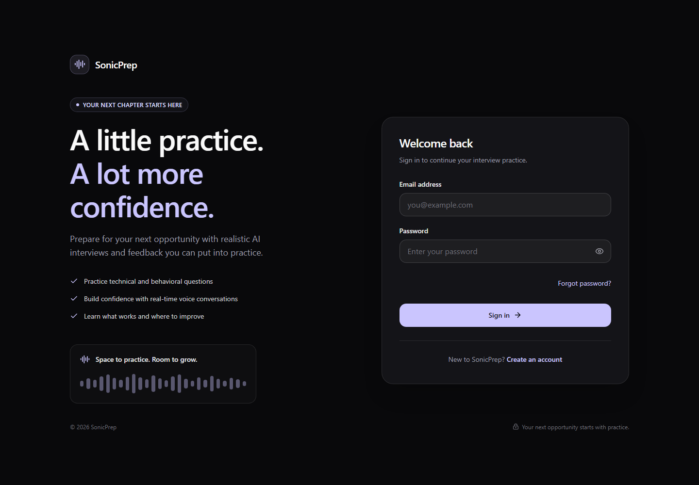

## Overview

SonicPrep is an AI interview practice app with voice conversations, role-specific questions, and structured feedback. Create an account, prepare an interview, practice your answers, and review your strengths and areas for improvement.

- **Account access:** email/password sign-up, sign-in, password reset, and session-based authentication.
- **Interview preparation:** questions tailored to a role, experience level, and technology stack.
- **Voice practice:** conversations with an AI interviewer through Vapi, with an on-screen transcript.
- **Feedback:** an overall score, category breakdowns, strengths, and suggested improvements based on the conversation transcript.
- **Dashboard:** revisit your interviews and explore community interviews.
- **Responsive interface:** light and dark modes, clear form validation, and layouts for desktop and mobile.

## Product tour

Screenshots show the current interface in a local documentation preview. Signed-in screens use fictional account details, sample interviews, and sample feedback. Voice calls and external services were not connected during capture. Desktop captures are 1440 px wide; mobile captures are 390 px wide.

### Account access

<table>
  <tr>
    <th width="50%">Sign in</th>
    <th width="50%">Create an account</th>
  </tr>
  <tr>
    <td><a href="docs/screenshots/sign-in.png"></a></td>
    <td><a href="docs/screenshots/sign-up.png">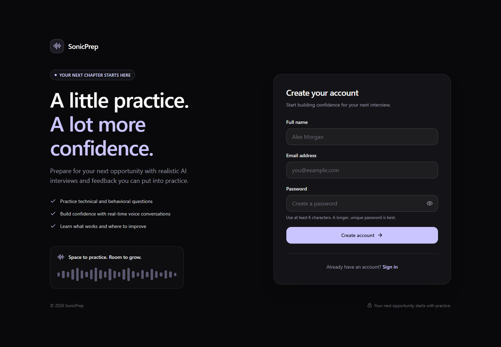</a></td>
  </tr>
</table>

### Dashboard

Start a new practice session, return to an existing interview, or choose a community interview.

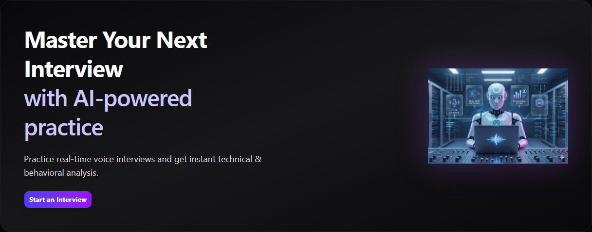

**Your interviews**

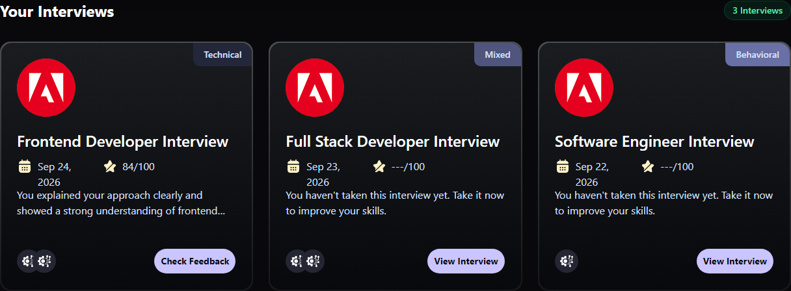

**Community interviews**

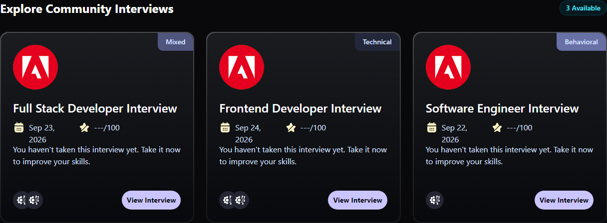

<details>
  <summary>View the complete dashboard</summary>

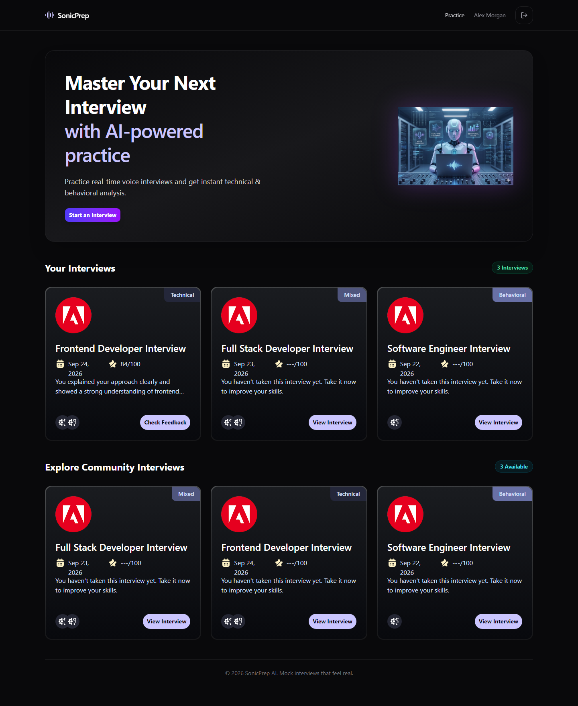

</details>

### Interview setup and practice

The setup screen starts the voice conversation used to prepare an interview. The practice screen loads a selected interview and its questions. Both captures show the ready state before a call begins.

<table>
  <tr>
    <th width="50%">Interview setup</th>
    <th width="50%">Interview practice</th>
  </tr>
  <tr>
    <td><a href="docs/screenshots/interview-setup.png">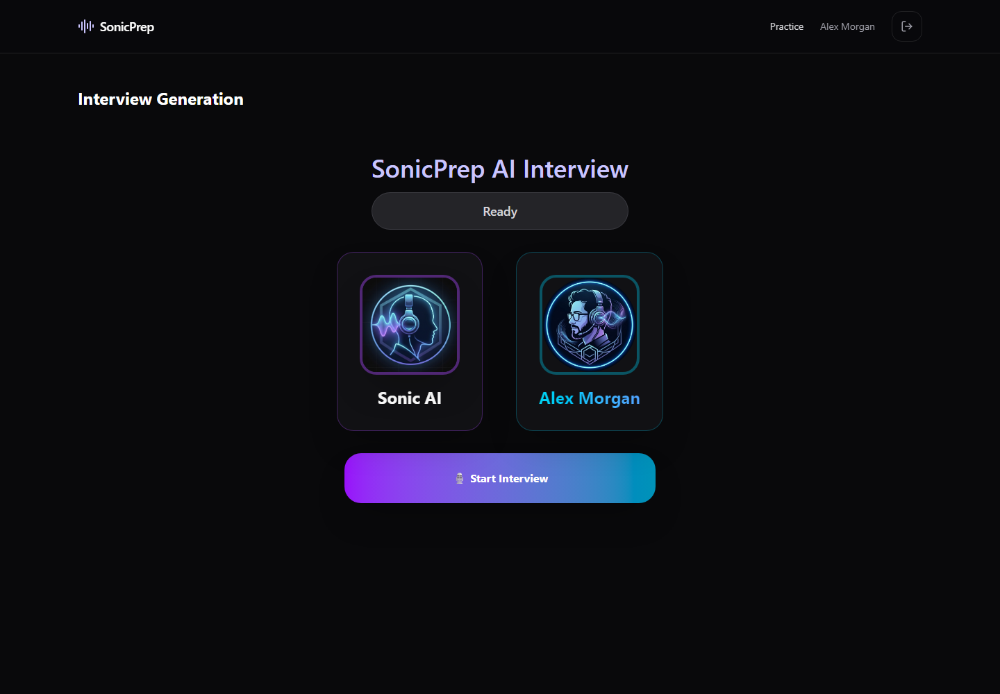</a></td>
    <td><a href="docs/screenshots/interview-practice.png">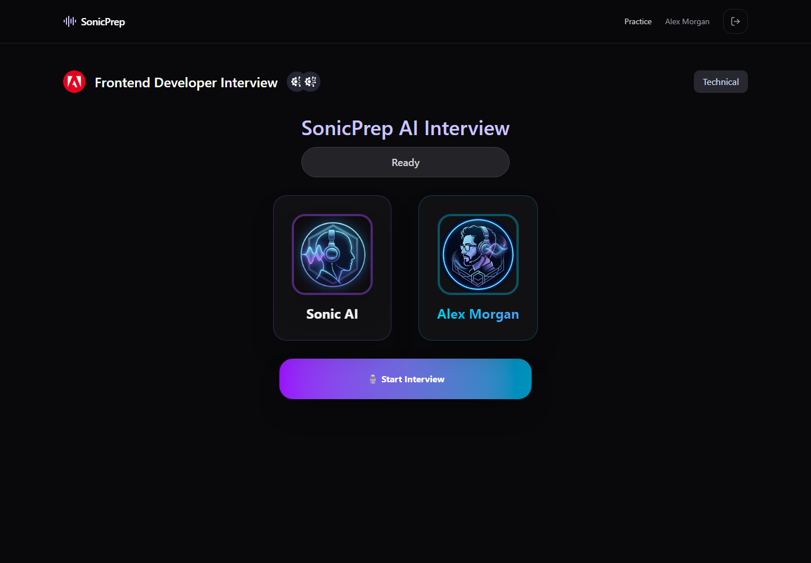</a></td>
  </tr>
</table>

### Feedback

Review the overall result, five assessment categories, strengths, and areas for improvement. Return to the dashboard or retake the interview.

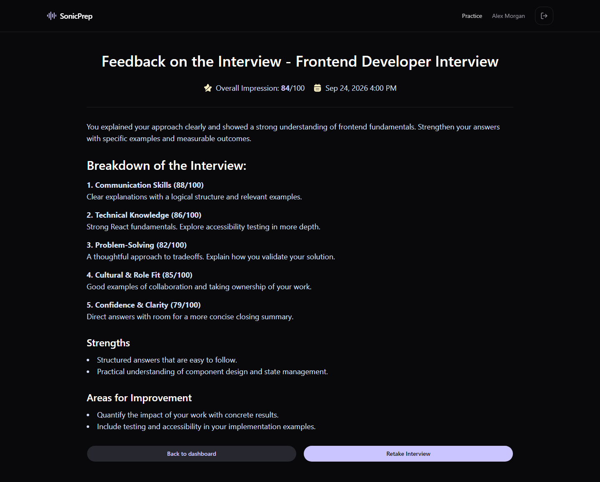

### Mobile experience

<table>
  <tr>
    <th width="50%">Sign in</th>
    <th width="50%">Sign up</th>
  </tr>
  <tr>
    <td valign="top"><a href="docs/screenshots/mobile-sign-in.png">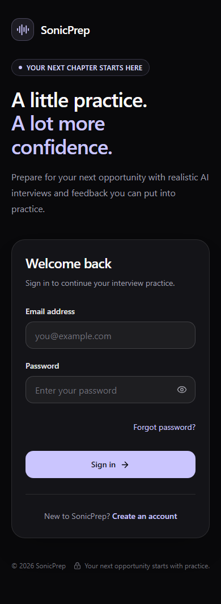</a></td>
    <td valign="top"><a href="docs/screenshots/mobile-sign-up.png">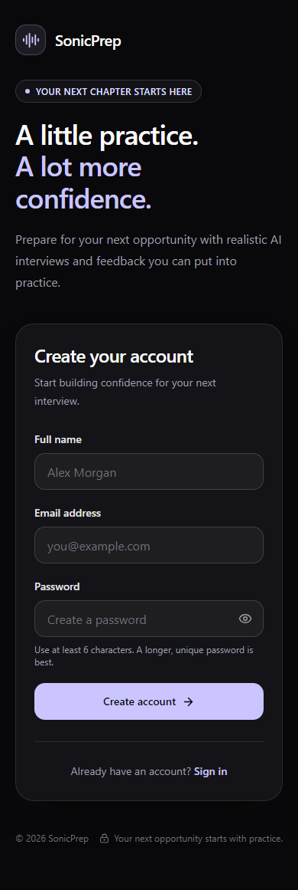</a></td>
  </tr>
</table>

<details>
  <summary>View the complete mobile dashboard</summary>

<p align="center">
  <a href="docs/screenshots/mobile-dashboard.png">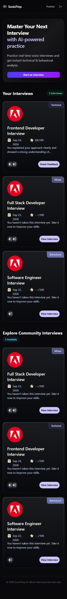</a>
</p>

</details>

## Technology

| Area                             | Implementation                                      |
| -------------------------------- | --------------------------------------------------- |
| Application                      | Next.js 16 App Router, React 19, TypeScript         |
| Interface                        | Tailwind CSS 4, Radix UI, Lucide icons              |
| Forms                            | React Hook Form and Zod                             |
| Authentication and data          | Firebase Authentication, session cookies, Firestore |
| Voice interviews                 | Vapi Web SDK                                        |
| Question generation and feedback | Google Gemini through the AI SDK                    |

## Getting started

Use Node.js 22.13+ on the 22.x line, or Node.js 24+, with npm. You will also need Firebase, Vapi, and Google AI credentials.

1. Download or clone this repository and open its root directory.
2. Install the locked dependencies:

   ```bash
   npm ci
   ```

3. Copy [`.env.example`](.env.example) to `.env.local` and fill in the values from your services.

   | Variables                                                              | Purpose                                                     |
   | ---------------------------------------------------------------------- | ----------------------------------------------------------- |
   | `NEXT_PUBLIC_FIREBASE_*`                                               | Firebase web app configuration                              |
   | `FIREBASE_PROJECT_ID`, `FIREBASE_CLIENT_EMAIL`, `FIREBASE_PRIVATE_KEY` | Firebase Admin service account                              |
   | `GOOGLE_GENERATIVE_AI_API_KEY`                                         | Gemini API access                                           |
   | `NEXT_PUBLIC_VAPI_WEB_TOKEN`                                           | Vapi public web token                                       |
   | `NEXT_PUBLIC_VAPI_WORKFLOW_ID`                                         | Vapi interview-generation configuration used by the app     |
   | `VAPI_WEBHOOK_SECRET`                                                  | Private shared secret for the interview-generation endpoint |

4. Enable **Email/Password** in Firebase Authentication, add your app domain to the authorized domains, and create a Firestore database. Configure the Vapi generation flow to send interview details to `/api/vapi/generate` on your reachable app URL. Set its `Authorization` header to `Bearer <VAPI_WEBHOOK_SECRET>` using the same private value configured on your server.
5. Start the development server:

   ```bash
   npm run dev
   ```

Open [localhost:3000](http://localhost:3000). Voice practice requires microphone permission. Keep `.env.local` private; live features require valid service configuration. Production builds do not require private credentials.

## Development

| Command                | Purpose                                               |
| ---------------------- | ----------------------------------------------------- |
| `npm run dev`          | Start the development server                          |
| `npm run lint`         | Check code quality                                    |
| `npx tsc --noEmit`     | Check TypeScript types                                |
| `npm test`             | Run authentication and interview API regression tests |
| `npm run check`        | Run lint, type checks, and tests                      |
| `npm run format:check` | Check consistent formatting                           |
| `npm run build`        | Create a production build                             |
| `npm start`            | Run the production build                              |

See [VERIFICATION.md](VERIFICATION.md) for test coverage, manual acceptance checks, and remaining verification work. Screenshot capture details are in [docs/screenshots/README.md](docs/screenshots/README.md).

## Author and license

Created by **Salony Ranjan** · [GitHub](https://github.com/salonyranjan) · [LinkedIn](https://www.linkedin.com/in/salony-ranjan-b63200280/)

Licensed under the [MIT License](LICENSE).
