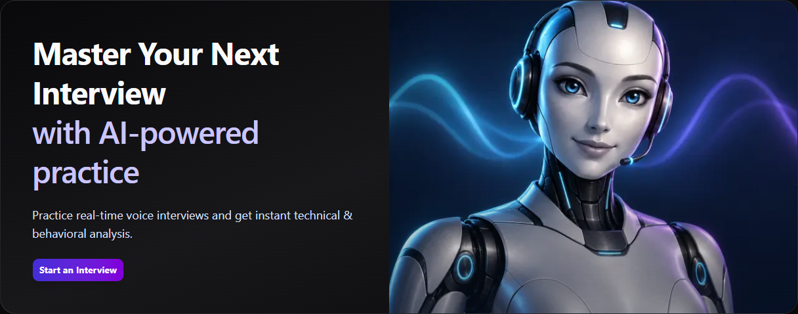
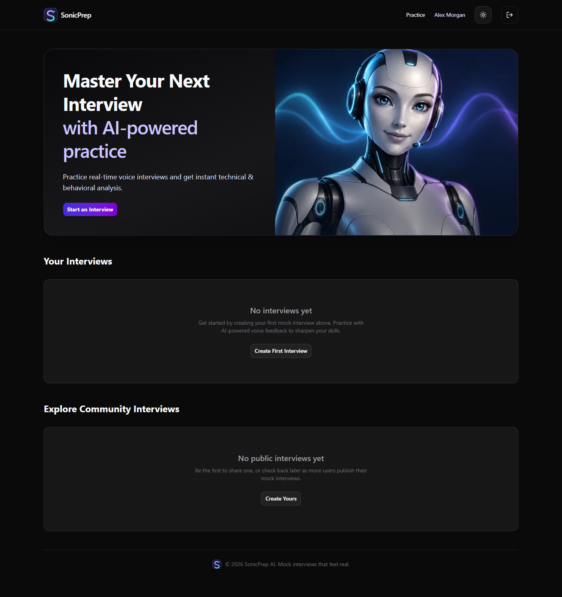
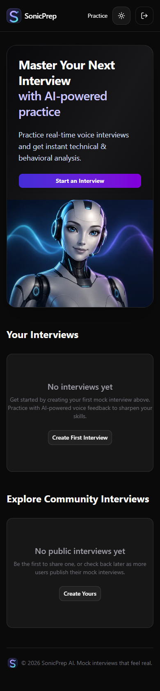
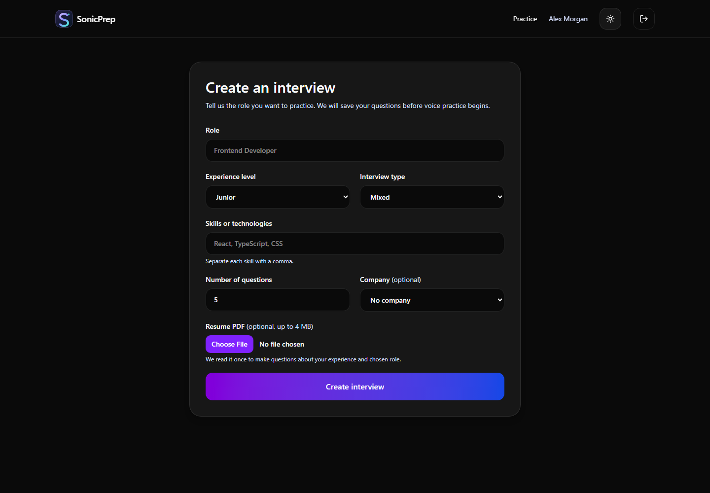
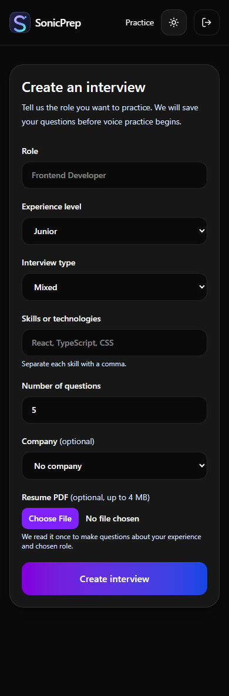
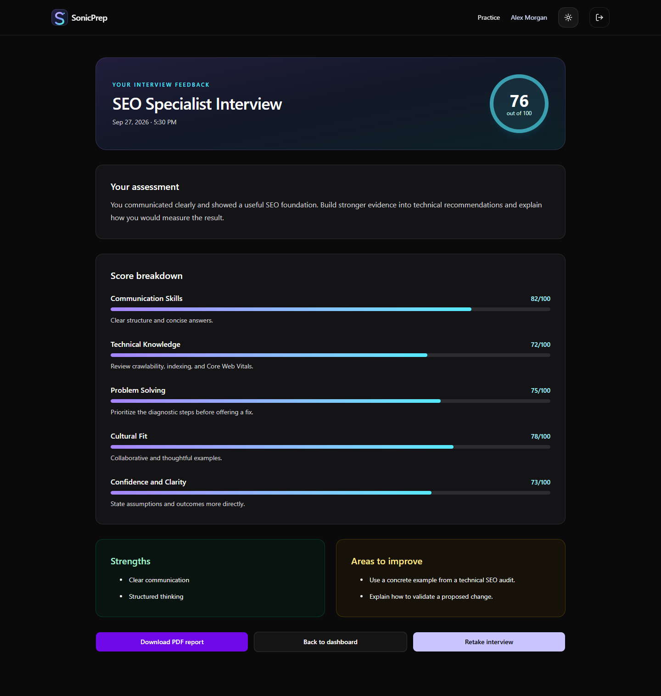
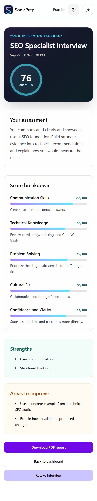
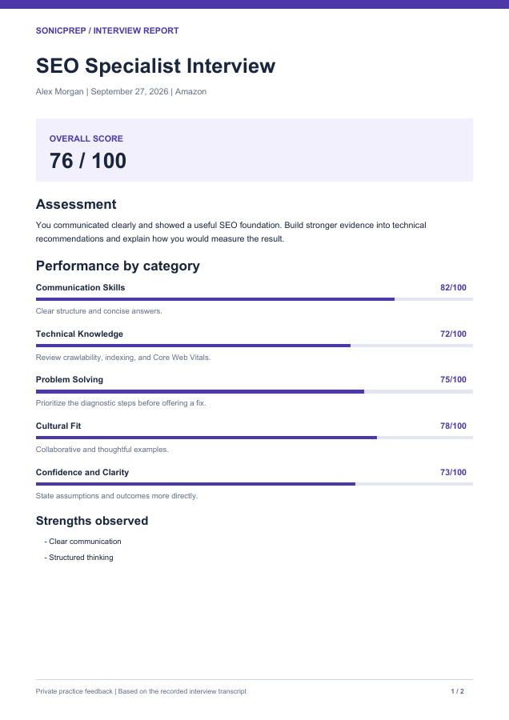
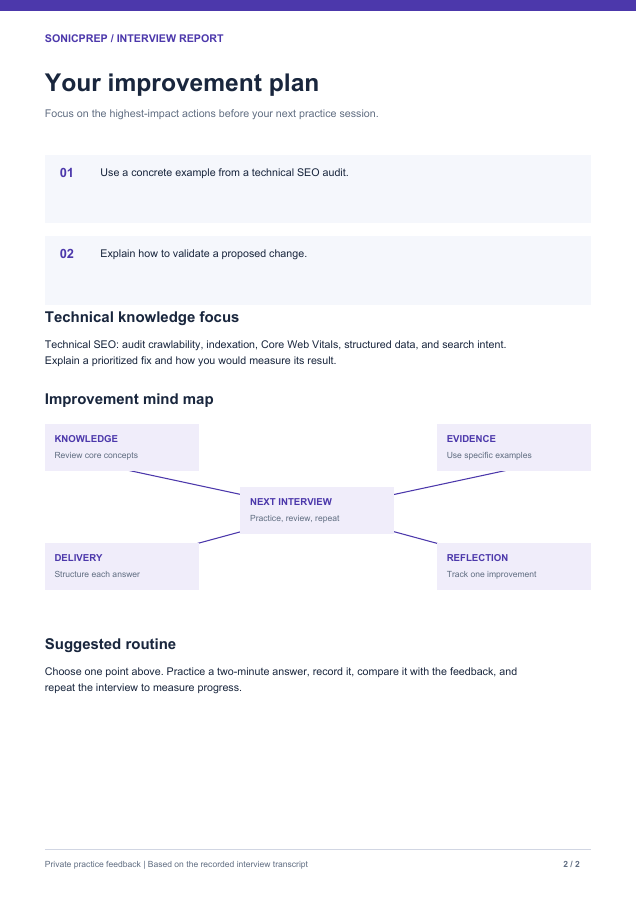

  
  <h1>SonicPrep</h1>
  
Practice the conversation. Understand the feedback. Walk into the real interview prepared.

  
<a href="#product-preview">Product preview</a> · <a href="#run-locally">Run locally</a> · <a href="#quality-checks">Quality checks</a>

## What it does

SonicPrep is a responsive interview practice app. Candidates prepare a role-specific interview, speak with an AI interviewer, and turn feedback into a practical improvement plan.

| Step      | Experience                                                                                                                                                                                                                           |
| --------- | ------------------------------------------------------------------------------------------------------------------------------------------------------------------------------------------------------------------------------------ |
| Prepare   | Create an interview for a role, experience level, and technology stack. Optionally upload a PDF resume for questions about your experience. Company interviews display the matching company cover where available, including Amazon. |
| Practice  | Choose a male or female candidate avatar before the voice session. Follow the live transcript while speaking with the AI interviewer.                                                                                                |
| Review    | See an overall score, five assessment categories, strengths, specific improvements, and a final assessment. Retake interviews and revisit your history.                                                                              |
| Take away | Download a two-page PDF with the assessment, prioritized next steps, an improvement mind map, and role-specific technical focus.                                                                                                     |

Email/password authentication, password reset, community interviews, and light and dark themes complete the experience. The interview view keeps SonicPrep branding in the navigation while the selected company cover identifies the session.

### Optional resume questions

On **Create an interview**, enter your target role, experience level, skills, interview type, and question count. You can add a PDF resume (up to 4 MB). SonicPrep reads the PDF once and uses its projects, skills, and achievements when generating role-specific questions. The first question names a resume detail. The interview is saved before the app opens voice practice, so a voice connection issue cannot prevent creation. The PDF is not stored; the temporary extracted text is deleted after questions are saved. Retries reuse the extracted resume within the same setup and recover an already saved interview without creating a duplicate. Incomplete extraction is rejected with a clear message. Leave the resume field empty for a standard interview. This uses the existing `GOOGLE_GENERATIVE_AI_API_KEY`; no extra service or key is needed.

## Product preview

The screenshots use fictional sample data, including an Amazon SEO Specialist interview. Select an image to see its full capture. The creation form saves the interview before voice practice begins. These previews do not show live Firebase, Gemini, or Vapi calls.

### Dashboard

<table align="center"><tr><th>Desktop</th><th>Mobile</th></tr><tr><td align="center"></td><td align="center"></td></tr></table>

### Create an interview

Choose a role, experience level, skills, and question count. Add an optional PDF resume for questions drawn from your experience.

<table align="center"><tr><th>Desktop</th><th>Mobile</th></tr><tr><td align="center" valign="top"></td><td align="center" valign="top"></td></tr></table>

Continue with [voice practice and a live transcript](docs/screenshots/mobile-interview-practice.png) once the interview is saved.

### Feedback and report

<table align="center"><tr><th>Desktop</th><th>Mobile</th></tr><tr><td align="center"></td><td align="center"></td></tr></table>

<table align="center">
  <tr><th>Assessment</th><th>Improvement plan</th></tr>
  <tr>
    <td align="center" valign="top"></td>
    <td align="center" valign="top"></td>
  </tr>
</table>

Account access: [desktop sign-in](docs/screenshots/sign-in.png) · [mobile sign-in](docs/screenshots/mobile-sign-in.png). See [screenshot notes](docs/screenshots/README.md) for capture details.

## Technology

| Layer                  | Tools                                                                 |
| ---------------------- | --------------------------------------------------------------------- |
| App and interface      | Next.js 16 App Router, React 19, TypeScript, Tailwind CSS 4, Radix UI |
| Forms                  | React Hook Form, Zod                                                  |
| Accounts and data      | Firebase Authentication, Firebase Admin, Firestore                    |
| Voice                  | Vapi Web SDK                                                          |
| Questions and feedback | Google Gemini through the AI SDK                                      |
| Resume PDF processing  | Google Gemini through the same AI SDK and key                         |

## Run locally

Use Node.js **22.13+** on the 22.x line or **24+**, and npm. Firebase, Vapi, and Google AI credentials are needed for the live interview flow.

1. Install dependencies with `npm ci`.
2. Copy [`.env.example`](.env.example) to `.env.local` and add your credentials:

   | Variable                                                               | Used for                                  |
   | ---------------------------------------------------------------------- | ----------------------------------------- |
   | `NEXT_PUBLIC_FIREBASE_*`                                               | Firebase web app                          |
   | `FIREBASE_PROJECT_ID`, `FIREBASE_CLIENT_EMAIL`, `FIREBASE_PRIVATE_KEY` | Firebase Admin                            |
   | `GOOGLE_GENERATIVE_AI_API_KEY`                                         | Gemini                                    |
   | `NEXT_PUBLIC_VAPI_WEB_TOKEN`                                           | Voice interview practice                  |
   | `NEXT_PUBLIC_VAPI_WORKFLOW_ID`, `VAPI_WEBHOOK_SECRET`                  | Legacy voice setup webhook, if still used |

3. Enable Email/Password in Firebase Authentication, authorize your domain, and create a Firestore database.
4. Configure the Vapi web token for voice practice. New interviews are created and saved in the app before the voice call starts; the legacy Vapi generation workflow is no longer required for creation.
5. Run `npm run dev` and open [localhost:3000](http://localhost:3000). Allow microphone access for voice practice.

Keep `.env.local` private. Production builds do not require live credentials, but connected interview features do.

## Quality checks

| Command                | Check                                    |
| ---------------------- | ---------------------------------------- |
| `npm run check`        | ESLint, TypeScript, and regression tests |
| `npm run format:check` | Formatting                               |
| `npm run build`        | Production compilation                   |
| `npm start`            | Serve the production build               |

## Author and license

Created by **Salony Ranjan** · [GitHub](https://github.com/salonyranjan) · [LinkedIn](https://www.linkedin.com/in/salony-ranjan-b63200280/)

Licensed under the [MIT License](LICENSE).
