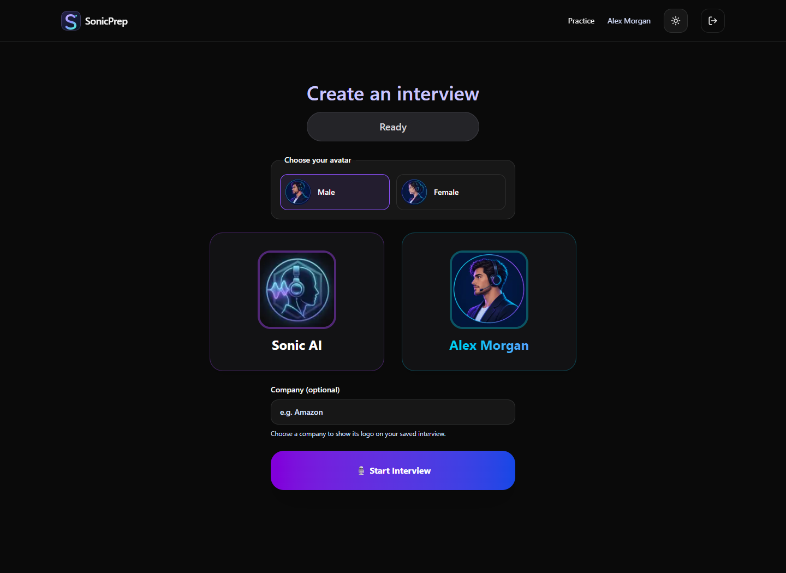
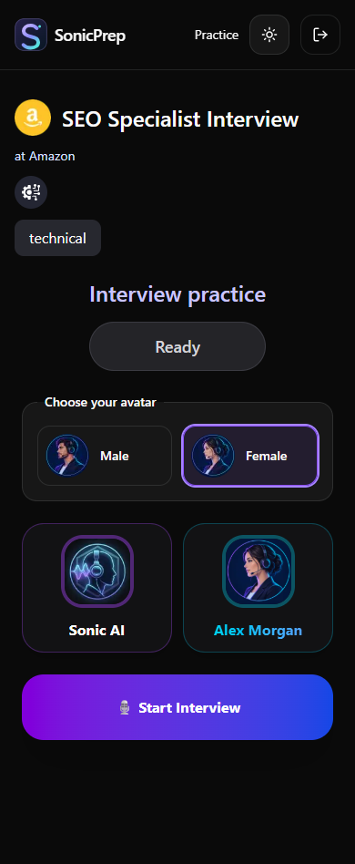

  
  <h1>SonicPrep</h1>
  
Practice the conversation. Understand the feedback. Walk into the real interview prepared.

  
<a href="#product-preview">Product preview</a> · <a href="#run-locally">Run locally</a> · <a href="#quality-checks">Quality checks</a>

## What it does

SonicPrep is a responsive interview practice app. Candidates prepare a role-specific interview, speak with an AI interviewer, and turn feedback into a practical improvement plan.

| Step      | Experience                                                                                                                                                       |
| --------- | ---------------------------------------------------------------------------------------------------------------------------------------------------------------- |
| Prepare   | Create an interview for a role, experience level, and technology stack. Company interviews display the matching company cover where available, including Amazon. |
| Practice  | Choose a male or female candidate avatar before the voice session. Follow the live transcript while speaking with the AI interviewer.                            |
| Review    | See an overall score, five assessment categories, strengths, specific improvements, and a final assessment. Retake interviews and revisit your history.          |
| Take away | Download a two-page PDF with the assessment, prioritized next steps, an improvement mind map, and role-specific technical focus.                                 |

Email/password authentication, password reset, community interviews, and light and dark themes complete the experience. The interview view keeps SonicPrep branding in the navigation while the selected company cover identifies the session.

## Product preview

The screenshots use fictional sample data, including an Amazon SEO Specialist interview. Each feature is shown at desktop and mobile sizes. Select an image to see its full capture. These previews show the interface, not live Firebase, Gemini, or Vapi calls.

### Dashboard

<table align="center"><tr><th>Desktop</th><th>Mobile</th></tr><tr><td align="center"></td><td align="center"></td></tr></table>

### Interview setup and practice

<table align="center"><tr><th>Desktop</th><th>Mobile</th></tr><tr><td align="center"></td><td align="center"></td></tr></table>

### Feedback and report

<table align="center"><tr><th>Desktop</th><th>Mobile</th></tr><tr><td align="center"></td><td align="center"></td></tr></table>

<table align="center">
  <tr><th>Assessment</th><th>Improvement plan</th></tr>
  <tr>
    <td align="center" valign="top"></td>
    <td align="center" valign="top"></td>
  </tr>
</table>

Account access: [desktop sign-in](docs/screenshots/sign-in.png) · [mobile sign-in](docs/screenshots/mobile-sign-in.png). See [screenshot notes](docs/screenshots/README.md) for capture details.

## Technology

| Layer                  | Tools                                                                 |
| ---------------------- | --------------------------------------------------------------------- |
| App and interface      | Next.js 16 App Router, React 19, TypeScript, Tailwind CSS 4, Radix UI |
| Forms                  | React Hook Form, Zod                                                  |
| Accounts and data      | Firebase Authentication, Firebase Admin, Firestore                    |
| Voice                  | Vapi Web SDK                                                          |
| Questions and feedback | Google Gemini through the AI SDK                                      |

## Run locally

Use Node.js **22.13+** on the 22.x line or **24+**, and npm. Firebase, Vapi, and Google AI credentials are needed for the live interview flow.

1. Install dependencies with `npm ci`.
2. Copy [`.env.example`](.env.example) to `.env.local` and add your credentials:

   | Variable                                                               | Used for                                   |
   | ---------------------------------------------------------------------- | ------------------------------------------ |
   | `NEXT_PUBLIC_FIREBASE_*`                                               | Firebase web app                           |
   | `FIREBASE_PROJECT_ID`, `FIREBASE_CLIENT_EMAIL`, `FIREBASE_PRIVATE_KEY` | Firebase Admin                             |
   | `GOOGLE_GENERATIVE_AI_API_KEY`                                         | Gemini                                     |
   | `NEXT_PUBLIC_VAPI_WEB_TOKEN`, `NEXT_PUBLIC_VAPI_WORKFLOW_ID`           | Voice interview flow                       |
   | `VAPI_WEBHOOK_SECRET`                                                  | Authenticated interview-generation webhook |

3. Enable Email/Password in Firebase Authentication, authorize your domain, and create a Firestore database.
4. Configure the Vapi generation flow to call `/api/vapi/generate` on your reachable app URL with `Authorization: Bearer <VAPI_WEBHOOK_SECRET>`.
5. Run `npm run dev` and open [localhost:3000](http://localhost:3000). Allow microphone access for voice practice.

Keep `.env.local` private. Production builds do not require live credentials, but connected interview features do.

## Quality checks

| Command                | Check                                    |
| ---------------------- | ---------------------------------------- |
| `npm run check`        | ESLint, TypeScript, and regression tests |
| `npm run format:check` | Formatting                               |
| `npm run build`        | Production compilation                   |
| `npm start`            | Serve the production build               |

[VERIFICATION.md](VERIFICATION.md) records tested flows and the live-service checks that still need configured credentials.

## Author and license

Created by **Salony Ranjan** · [GitHub](https://github.com/salonyranjan) · [LinkedIn](https://www.linkedin.com/in/salony-ranjan-b63200280/)

Licensed under the [MIT License](LICENSE).
